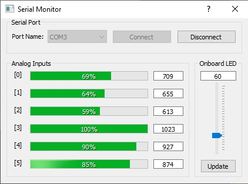

### PyQt5 Serial Port Example

For the hardware I used Arduino. The arduino code can be used with Arduino Uno, Nano or Mega 2560. No Special circuit is needed for testing the program. The program shows the voltages on board analog inputs. You can also dim the on-board led light with right side slider and update button. on every serial port receive interrupt the UI updates.

